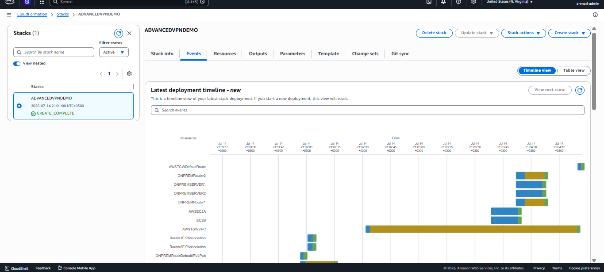
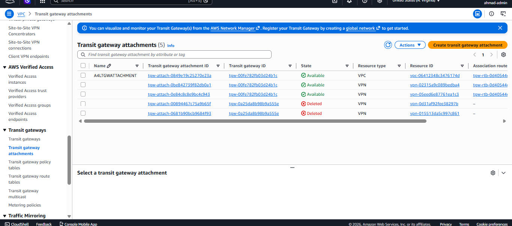
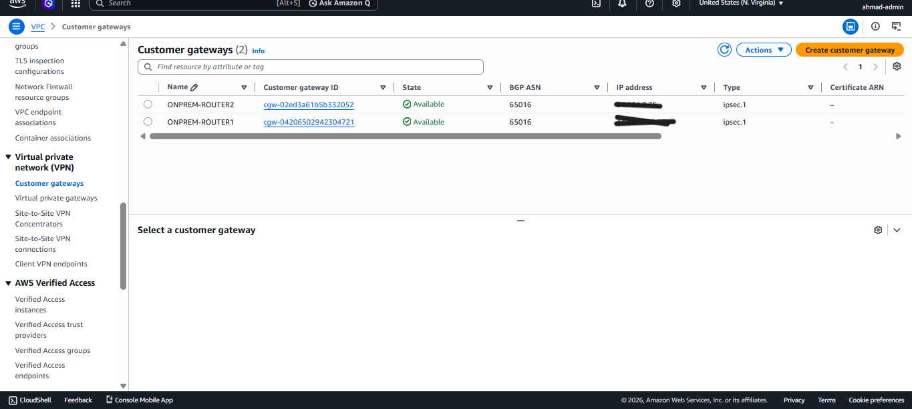
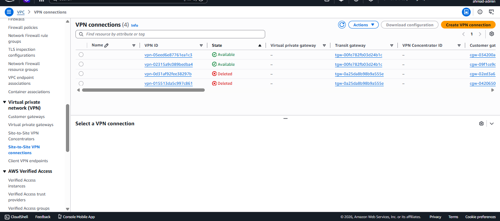
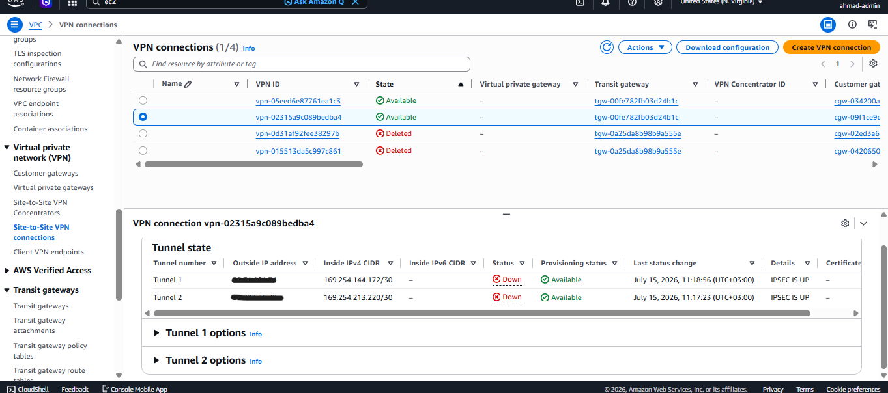
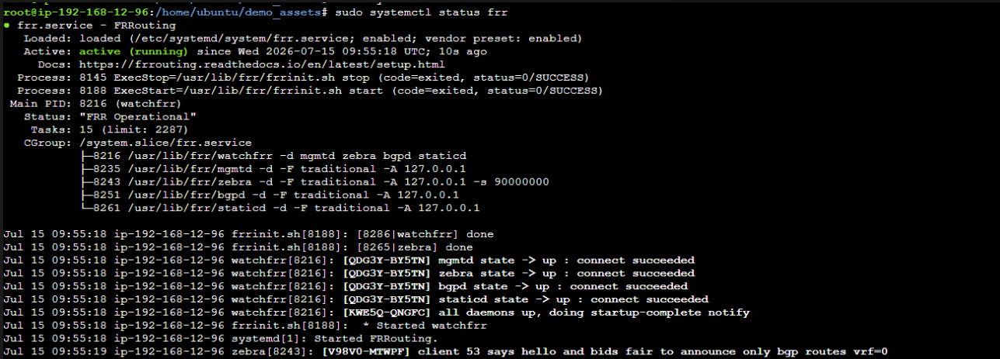
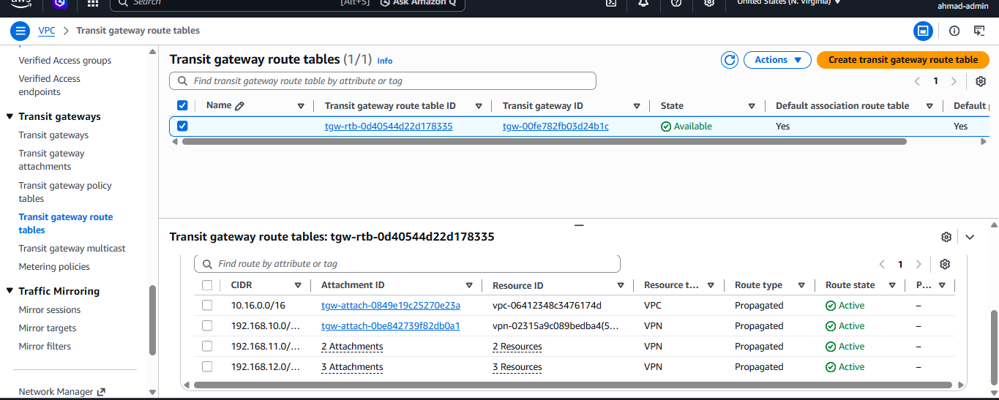
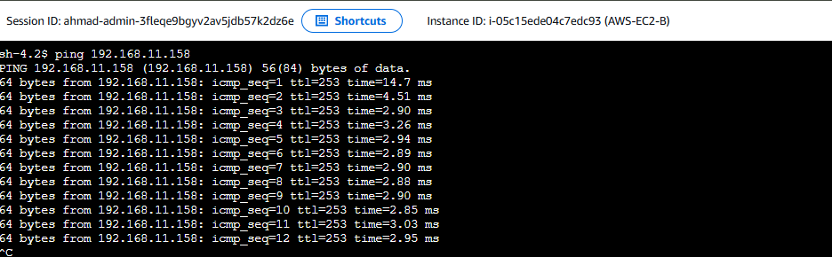

# ☁️ Highly Available Dynamic BGP Site-to-Site VPN on AWS

### 📌 Project Overview
In this advanced cloud networking project, I engineered and deployed a Highly Available (HA) Site-to-Site VPN connecting an AWS cloud environment to a simulated on-premises data center. This architecture utilizes AWS Transit Gateway (TGW) as a central routing hub, leveraging dynamic routing via BGP to ensure seamless failover and redundancy across multiple IPSec tunnels.

### 🛠️ Architecture & Technologies Used
* **AWS Cloud Services:** Virtual Private Cloud (VPC), Transit Gateway (TGW), Site-to-Site VPN, Customer Gateways, CloudFormation, EC2.
* **On-Premises Simulation:** Ubuntu Linux EC2 instances acting as core routers.
* **IPsec VPN:** Configured StrongSwan for secure, encrypted tunnel establishment (IKEv1/IKEv2).
* **Dynamic Routing:** Compiled and deployed FRRouting (FRR) from source to manage BGP peerings and dynamic route propagation.

---

### 🏗️ Deployment Stages & Technical Evidence

#### Stage 1: Base Infrastructure Provisioning
* Deployed the foundational VPCs, subnets, and EC2 instances across both the simulated on-premises and AWS environments using CloudFormation and manual console configuration.
* All instances operational, including the dual On-Premises Linux routers required for High Availability.

#### Stage 2: Transit Gateway & Customer Gateways
* Centralized the network architecture by deploying an AWS Transit Gateway. 
* Configured Customer Gateways mapping to the public IP addresses of the simulated on-premises Linux routers and assigned internal BGP ASNs (65016).

#### Stage 3: IPSec Tunnel Establishment
* Configured StrongSwan (`ipsec.conf` and `ipsec.secrets`) on the Linux routers to establish secure, encrypted IPSec tunnels to the AWS Virtual Private Gateways.
* AWS Console confirming the VPN connections are Available and passing health checks.

#### Stage 4: Dynamic Routing with BGP (FRRouting)
* Discarded static routes in favor of BGP to achieve true High Availability. 
* The FRRouting daemon was configured to dynamically advertise on-premises CIDR blocks to the AWS Transit Gateway and learn AWS routes in return.

#### Stage 5: End-to-End Connectivity Verification
* The ultimate test of a Site-to-Site VPN architecture: successfully passing ICMP traffic from an AWS-hosted EC2 instance to an On-Premises private server through the encrypted BGP tunnels.

---

### ⚠️ Real-World Troubleshooting & Engineering Challenges
Deploying advanced routing daemons from source code on Linux rarely goes perfectly. During this project, I successfully diagnosed and resolved deep system-level compilation errors:

#### 1. Missing GCC Compiler Dependencies
* **The Issue:** The default Ubuntu image lacked the required compiler plugins for FRRouting. I diagnosed build failures caused by kernel mismatches.
* **The Fix:** Manually installed the `gcc-plugin-dev` headers to resolve them.

#### 2. Module Bypassing via Script Patching
* **The Issue:** The default FRR installation script crashed while attempting to compile a broken RPKI routing security module.
* **The Fix:** Utilized `nano` to patch the bash script on the fly, injecting `--disable-rpki` and `--disable-doc` flags to force a clean, customized compilation.

#### 3. Daemon Configuration Hardening
* **The Issue:** After bypassing the broken modules, the BGP daemon (`bgpd`) entered a crash loop looking for the missing files.
* **The Fix:** Modified the `/etc/frr/daemons` system configuration to explicitly remove the `-M rpki` load instruction, resulting in a stable, operational routing engine.
